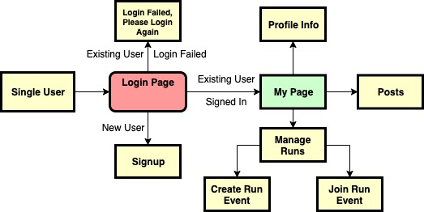
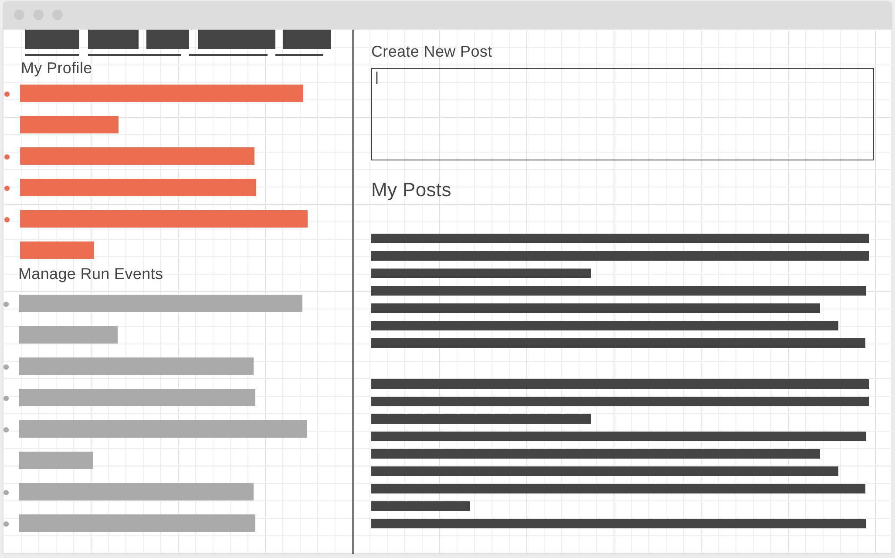
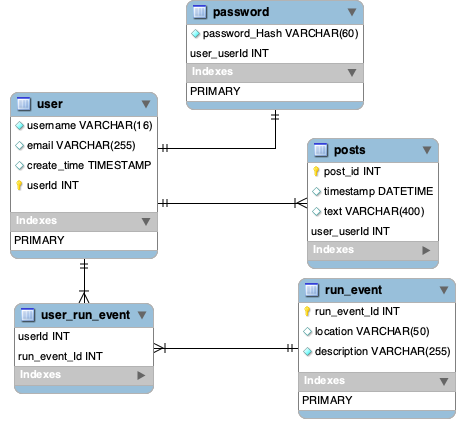

# RunBook - Social Network Site for runners

## Overview of Service

RunBook brings runners around to have a run together and share experience and improve their lifestyle. People can come together for a run, track their distance, find new friends and be physically and emotionally healthy.

## Target User

- Practically anyone who is fit enough to run and above 16 years of age.
- Can also be used by company employees to form a runner's club.

## Value Provided

- Physical and emotional health benefits.
- The platform can also serve as an advertising medium for healthcare products to find the targeted audience. 
- Planned community runs around scenic places.
- Charity runs to attract sponsors. 

## Framework / Tool

A CRUD app with MVC framework

Frontend - React </br>
Backend - Spring Boot </br>
Database - MySQL

 - Choose Spring Boot because of its well established community and online support 
 - React because I needed only View part of the MVC, and plan to implement Model and Controller part with MySQL and Spring Boot

## Application Flow



### Functionalities:

1.  Login page, email and password, option for registration for first time user

2. Credentials not matching, alert displayed on the login page, also give option to register if not registered before

3. Registration page details:
    - Name
    - Email
    - Password
    - Age

4. My Page information:
    - [TOP LEFT] - Profile information
    - [BOTTOM LEFT] - Manage runs: Create run event, Join run event
    - [CENTER] - POSTS  



## DB Schema



## Infrastructure

List of AWS services: 
- VPC 
- EC2 - 2, 1 for MySQL and other for Spring Boot and React frontend
- ECS -Docker container deployment
- CloudWatch - for logging

MySQL for Database </br>
Spring Boot for Backend

## Rest API Design

```
.
├── _userRegistration
|   └── HTTP POST /users  
├── _profilePage
|   ├── HTTP GET /users/{id}/profile
|   ├── HTTP POST /users/{id}/profile
|   └── HTTP PUT /users/{id}/profile
├── _posts
|   ├── HTTP GET /users/{id}/posts
|   ├── HTTP POST /users/{id}/posts
|   ├── HTTP PUT /users/{id}/posts/{id}
|   └── HTTP DELETE /users/{id}/posts/{id}
├── _runEvent
|   ├── HTTP GET /run
|   ├── HTTP POST /run
|   ├── HTTP PUT /user/{id}/run/{id}
|   └── HTTP DELETE /run/{id}

```


## Security

- Spring Boot Security for CSRF attacks and other most common type of attacks.
- Storing Password Hash instead of plain text passwords.
- Since we are planning to use React, there is relatively less risk of XSS because :
    - String variables in views are escaped automatically
    - With JSX you pass a function as the event handler, rather than a string that can contain malicious code

## Monitoring & Logging

- AWS CloudWatch for application and infrastructure 
- Spring Boot Log

## Test

- Unit Tests for Java using JUnit
- JEST for ReactJS testing

## Development Schedule

Week Nov 11 ~ 15

- Milestone 1, Nov 13:
1. Setup React Project
2. Create Login page
3. Create profile, posts and run event components
4. Finish view part

- Milestone 2, Nov 15:
1. Setup Spring API server
2. Setup SQL server
3. Insert dummy data

Week Nov 18 ~ 22

- Milestone 3, Nov 20:
1. Implement REST API (GET POST PUT DELETE)
2. Implement controller
3. Write tests

- Milestone 4, Nov 22:
1. implement login, storing sessions in frontend backend
2. Write unit tests

Week Nov 25 ~ 29

- Milestone 5, Nov 22:

1. Dockerize containers, AWS hosting
2. Logging, Monitoring, Security
3. Wrapping up

